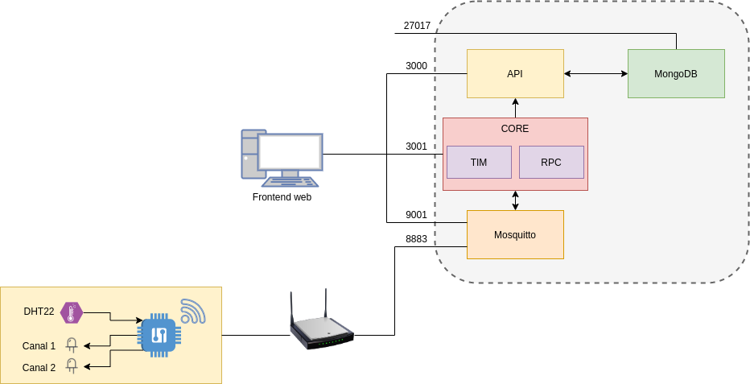

MIoT - DAIoT: Trabajo Final - Backend
=======================

## Primeros pasos

### Instalar las dependencias

Para correr este código es necesario contar con Docker y Docker-compose instalados. Para instalarlos en Linux, se pueden seguir los pasos del siguiente [artículo](https://www.gotoiot.com/pages/articles/docker_installation_linux/).

### Descargar el código

Para descargar el código se debe ejecutar el siguiente comando:

```
git clone https://github.com/mmondani/MIoT_DAIoT_Backend.git
```
Una vez hecho esto, se deben descargar los submódulos del proyecto. Moverse a la carpeta raiz del repositorio clonado y ejecutar el siguiente comando:

```
git submodule update --init --recursive --remote
``` 

### Ejecutar el código

Para ejecutar el backend se debe correr el comando `docker-compose up` desde la raiz del proyecto. 

## Detalles de implementación

El backend se compone de 4 contenedores:

- Base de datos MongoDB
- Broker MQTT Mosquitto
- API REST
- Servicio Core




### Base de datos

El contenedor de la base de datos tiene un script de inicialización (`mongo-init.js`) el cual se encarga de:

- Crear el usuario `iotuser`
- Crear la base de datos `iot`
- Crear las collections
- Insertar en la collection iotUser el usuario `admin`

La base de datos `iot` se compone de las siguientes collections:

- iotAccion
- iotAtr
- iotDato
- iotDisp
- iotEmpresa
- iotUser

### Broker MQTT

La comunicación con los dispositivos se va a hacer a través de MQTT. Para esto, se implementa un contenedor de Mosquitto.

Cuando inicia, va a tomar la configuración del archivo `mosquitto.conf` que se encuentra en la carpeta `broker/mosquitto/config`.

El broker va a estar escuchando en los puertos `1883` y `8883`. En el caso de este último, la comunicación va a usar TLS.

Por lo tanto, es necesario cargar los certificados del broker. Estos certificados se ponen en la carpeta `broker/mosquitto/certs`.

Para generar los certificados se puede usar el script `crea_certs.sh` que se encuentra en la carpeta `broker/scripts`


### API REST

La API es un fork del siguiente repositorio:

``` 
https://github.com/mcastellogh/daiot-api
```

### Core

El servicio core es un fork del siguiente repositorio:

``` 
https://github.com/mcastellogh/daiot-core
```

Como este servicio se conecta al broker MQTT, se deben cargar los certificados que va a usar para autenticarse. Los mismos se deben poner en la carpeta `core/certs`.